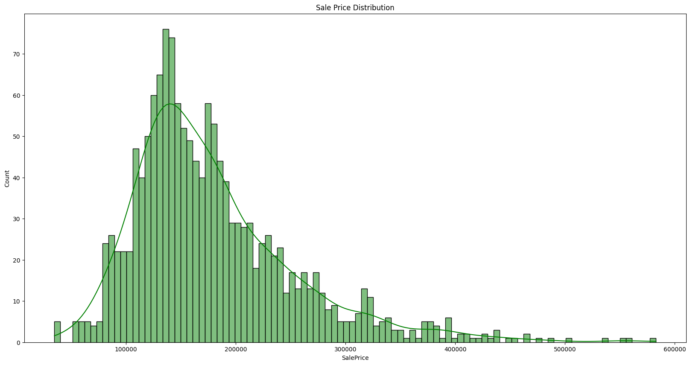
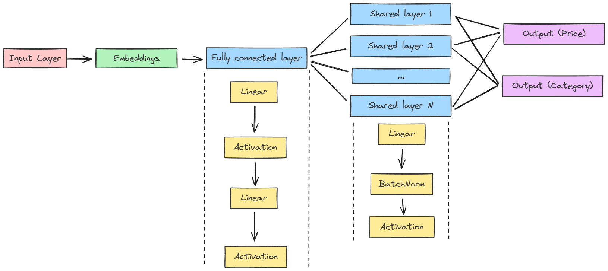
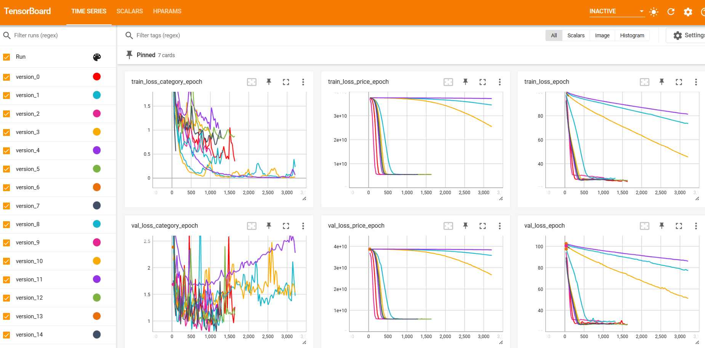

# House Price and Category Prediction using multi-task neural networks

This repository contains the code and data for the final project for MGSC 673 - Introduction to AI & Deep Learning taught by [Prof. Fatih Nayebi](https://github.com/conqueror). The final project is a part of the course curriculum for the Master of Management in Analytics (MMA) program at the Desautels Faculty of Management, McGill University.

## Main Objective

The primary objective of this project is to build a multi-task learning model that predicts both house prices (a regression task) and house category (a classification task) using the [House Prices - Advanced Regression Techniques Dataset](https://www.kaggle.com/c/house-prices-advanced-regression-techniques) from Kaggle. The project aims to leverage the power of [PyTorch Lightning](https://lightning.ai/docs/pytorch/stable/) to manage the complexity of building and training multi-task neural networks while exploring various activation functions, optimizers, and loss functions to optimize model performance.

Traditional neural networks are typically trained for only one task, and accordingly their loss function is chosen. For this project, however, the biggest challenge faced was choosing the proper loss function to ensure the model learns both the tasks, instead of favoring one over the other.

## Project Steps

### Data Exploration and Preprocessing

- Conducted thorough data exploration to understand the structure, distributions, and relationships within the dataset. The distribution of the two target variables can be seen below:

- Handled missing values, and normalized numerical variables to ensure data quality and compatibility with the neural network model.
- Categorical variables were encoded using label encoding, and then treated separately in the [embedding layers](#multi-task-model-building).

### Multi-task Model Building

- Constructed a feed-forward neural network using PyTorch Lightning to concurrently predict house prices and house categories.
- Utilized an embedding layer for categorical features to facilitate the learning of representations and relationships during training, offering advantages over one-hot encoding by preserving inherent relationships.
- Designed a shared bottom architecture to capture common features across tasks, with specialized top layers for regression and classification tasks, as illustrated below: 

### Loss function

- Utilized appropriate loss functions for each task: Mean Squared Error (MSE) for regression and Cross-Entropy Loss for classification.
- Combined the individual task losses into a single loss function using details in a paper on uncertainity weighting from Kendall et. al. The paper can be found here: [arXiv:1705.07115 [cs.CV]](https://arxiv.org/abs/1705.07115)
- The final loss function is:
  
    $$L = (L_{R} \cdot \exp(-\eta_1) + \eta_1) + (L_{C} \cdot \exp(-\eta_2) + \eta_2)$$

    where,
  - $L_{R}$ is the MSE loss for regression
  - $L_{C}$ is the cross-entropy loss for classification
  - $\eta_{1}, \eta_{2}$ are the uncertainty weights for each task
  
  The model learns the values of $\eta_{1}, \eta_{2}$ as it trains.

### Model logging and evaluation

- Utilized PyTorch Lightning's built-in functionality and integration with Tensorboard for logging, visualization, and model checkpointing to track and analyze model performance. 
- Evaluated the model's performance using suitable metrics for each task: Root Mean Squared Error (RMSE) for regression, and Accuracy and F1-score for classification.

### Hyperparameter tuning

- Performed hyperparameter optimization using PyTorch Lightning's integration with Optuna to find the best combination of hyperparameters for optimal model performance.
Explored various hyperparameters such as learning rate, number of layers, hidden layer dimension, and embedding dimensions.

## Results and findings

- The best activation function and optimizer for this project were [`LeakyReLU`](https://pytorch.org/docs/stable/generated/torch.nn.LeakyReLU.html#torch.nn.LeakyReLU) and [`AdamW`](https://pytorch.org/docs/stable/generated/torch.optim.AdamW.html).
- Hyperparameter tuning using Optuna led to further improvements in model performance, highlighting the importance of systematic hyperparameter search.
- The model acheived a RMSE of ~$76,000 on the regression task and a classification accuracy of ~72% on the validation set.

## Repository Structure

- `src/`: Contains the source code for data preprocessing, model definition, and training scripts.
  - `preprocessing.py`: Functions for data cleaning, feature engineering, and data splitting.
  - `network.py`: Defines the multi-task neural network architecture using PyTorch.
  - `dataset.py`: Creates PyTorch Dataset and DataLoader for efficient data loading.
  - `learner.py`: Implements the PyTorch Lightning module for training and evaluation.
  - `hparam_tuning.py`: Defines the objective function for hyperparameter tuning using Optuna.
  - `loss_callback.py`: Implements a custom Lightning callback function to log training and validation losses
  - `classes.py`: Contains a dataclass to hold model parameters
- `train.ipynb`: Performs EDA, trains the multi-task model and evaluates its performance.
- `data/`: Contains the raw datasets.

## Future Work

- Deploy the trained model as a web application or API for real-time house price and category predictions.
- Explore more advanced neural network architectures such as Convolutional Neural Networks (CNNs) or Recurrent Neural Networks (RNNs) to capture spatial or temporal dependencies in the data.
- Investigate the use of transfer learning to leverage pre-trained models for feature extraction or initialization.
- Extend the multi-task learning framework to include additional tasks such as predicting the quality of houses or estimating the time to sell.
